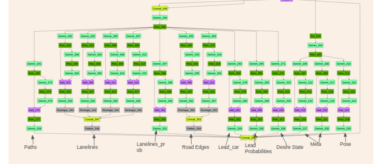

# openpilot-pipeline

[Openpilot](https://github.com/commaai/openpilot) is the currently leading[^1] Advanced Driver-Assitance System (ADAS), developed & open-sourced by [Comma AI](https://comma.ai/).

This repo attempts to re-create the full data & training pipeline to allow training custom driving models for Openpilot.

## About

The project is *in early development*. The ultimate goal is to create a codebase for training end-to-end autonomous driving models.

The only implemented feature right now is distillation of path planning *from the original Openpilot driving model*. To train from scratch, we need to implement creation of accurate ground truth paths by processing data from cars' GNSS, IMU and visual odometry with [laika](https://github.com/commaai/laika) and [rednose](https://github.com/commaai/rednose) (PRs welcome!).

Below we describe the implemented parts of the pipeline and current training results.

## Model
The neural network architecurre of the model consists of a Convolutional feature extractor which is a Resnet based custom feature extractor, followed by a GRU (used to capture the temporal context) and at the end we have different outputs heads which comprises of fully connnected layers responisble for outputs like paths, lanelines road edges and other meta information which is explained in detail below. 

<table>
  <tr>
    <td>CNN Feature Extractor</td>
     <td>GRU</td>
     <td>Output Heads</td>
  </tr>
  <tr>
    <td></td>
    <td></td>
    <td></td>
  </tr>
 </table>

The model visualized above is taken from [Openpilot 0.8.10 Release](https://github.com/commaai/openpilot/tree/v0.8.10/models) and you can find the same 'supercombo.onnx' model in this [repository ](https://github.com/nikebless/openpilot-pipeline/tree/main/common/models). 

The visualization tool used for onnx architecures: [netron](https://github.com/lutzroeder/netron) and the installation instructions can be found under the parent repository.

Detailed definations of the inputs and outputs of the model are mentioned [here](https://github.com/commaai/openpilot/tree/master/models). 
### Inputs
As mentioned above we can divide the model architecture into two parts encoder and decoder. Where the encoder part is made up of CNN feature extractor and a GRU, whereas decoder is mutliheaded fully connected layers responsible for outputs. 

The primary input to the model are two consecutive frames which are converted into YUV 4:2:0 format and stacked to form a tensor of shape `(1,12,128,256)`.
* ##### YUV 4:2:0
  * It is a color subsampling technique.
  * Ecodes only 20% of the color infromation.
  * Saves memory footprint
  * Computationally efficient. 

Apart from the images there are three more inputs which are fed to the model in the intermediate stage where extracted features are passed into the GRU. So the GRU takes in extracted CNN features, desire, traffic convention and recurrent state. 
* ##### Desire
  * Desire in general for one sample is a 1-D vector with shape of `(1,8)`. In simpler terms it can be interpreted by the desirable actions performed by the driver during a drive scenario when openpilot is engaged. 

More concrete infromation can be obtained from [here](https://github.com/commaai/cereal/blob/5c64eaab789dfa67a210deaa2530788843474999/log.capnp). 
* ##### Traffic Convention
  * As similar to desire for one sample it is a 1-D vector of shape `(1,2)` which is one hot encoded according to the LHD(Right Hand Driving) and RHD(Right Hand Driving). 
* ##### Recurrent State
  * This is basically taken from the output of the network which is refeed again to the the GRU. 

### Outputs
At the last part of the architecure all the ouputs from the fully connected branches are concatenated, thus the output of the model is of shape `(n,6472)` where n is the batch size.
The output vector is parsed according to index and the outputs can be obtained. The method to parse the output vector can be found in the older versions of the [openpilot](https://github.com/commaai/openpilot/blob/v0.8.5/selfdrive/modeld/models/driving.cc) and can be obtained [via](https://github.com/commaai/openpilot/tree/master/models). All the outputs are predicted in the form of mean, standard deviation and logits and regressed over time. All the predictions like path plans, lanelines, road_edges  are carried out for future 33 timestamps which spans upto 10 seconds from the current frame and each time stamp is associated with a distance from 0 to 192 meters. You can find the refference for that in the openpilot code with arguments named **T_IDXS** and **X_IDXS**. All the outputs from the model are predicted in comma's so called calibrated frame of refference, which is explained in detail [here](https://github.com/commaai/openpilot/tree/master/common/transformations).
* ##### Paths Plans
  * The model predicts 5 potential desired plans with the shape of $(n, 4955)$, which can be further splitted into 5 equal arrays with shape `(1,991)`. 
  * Further `(1,991)` is divided into paths and path probabilty.
  * Each path is associated with a probability.
  * To obtain the actual meaningful arrays for one path `(1,990)` can be reshaped to `(1,2,33,15)`.
  * `[:, 0, :, :]` = mean and  std = `[:, 1, :, :]`, for the following values.
  
* ##### Lanelines 
  * Modle predicts 4 potential lanelines, where the shape of the parsed vector is `(n,528)`.
  * This `(n,528)` can be further reshaped into `(4,2,33,2)`.
  * The four lanelines can be named as outer_left, inner_left, inner_right, outer_right.
  * The ego vehicle is always in the middle lane(inner_left and inner_right).
* ##### Laneline Probabilites 
  * Probability that each of the 4 lanes exist.
* ##### Road Edges
  * Model predicts two road edges left and right. 

* ##### Leads
* ##### Leads Probabilites 
* ##### Desire State

* ##### Meta

* ##### Pose

* ##### Recurrent State


### Converting the model from ONNX to PyTorch

To not have to recreate the Openpilot model from scratch, we convert it from the ONNX format to PyTorch using [onnx2pytorch](https://github.com/ToriML/onnx2pytorch). Note: there is a bug in onnx2pytorch which makes it not work with openpilot's model; follow this [PR](https://github.com/ToriML/onnx2pytorch/pull/38) to fix it.

### Loss functions
- As mentioned above we are doing model distillation and currently training for just paths. All the predictions are in the terms of mean, standard deviation and logits. So we are first creating distribution [objects](https://pytorch.org/docs/1.7.1/distributions.html) and then calculating KL divergence for those distribution objects. 

- In the case when we are not using the model distillation we can use Gaussian or Laplacian NLL losses for all the regression outputs. For all the Multihypothesis strategies we can implement a basic-winner-to-take-all loss. 

- If we try to train for more than one task, the total loss can be calculated by summing all the losses for the tasks or task-loss balancing strategies can be implemeneted for refine results.  

## Data pipeline

For knowledge distillation, we run the official Openpilot model on the full dataset and save the outputs. This is done by `gt_hacky`.

Real ground truth creation is currently not implemented.

For the dataset, we use [comma2k19](https://github.com/commaai/comma2k19), a 33-hour (1980 min) driving dataset made by CommaAI: 

> The data was collected using comma EONs that has sensors similar to those of any modern smartphone including a road-facing camera, phone GPS, thermometers and 9-axis IMU. Additionally, the EON captures raw GNSS measurements and all CAN data sent by the car."

To use your own data for training, you currently need to collect it with a [Comma 2 device](https://comma.ai/shop/products/two) (no support for version 3 yet). In the future when true ground truth creation is implemented, you *might* be able to use a different device, but you'll need to adjust some of the hardware-related code (camera intrinsics, GNSS configuration in laika post-processing, etc). If you need more data than you can store on the device or Comma cloud, or you want to do it at scale, you can use a custom cloud server that re-implements Comma's API, called [retropilot-server](https://github.com/florianbrede-ayet/retropilot-server).


## Training pipeline

### Training loop


* **General:** 
  * A batch from the dataloader consists of stacked frames, groundtruth of plans and plan probabilities and a tensor which will define when a segment is finished. 
  * Recurrent state of the GRU and desire are intialized with zeros. 
  * Traffic convention is initialized as a one-hot vector with LHD.
  * An iteration is completed when a batch is processed.  
  * For a single iteration samples are processed by looping over sequence length and step loss is calculated and in the end batch loss is calculated by diving it by sequence lenght and batch size. 
  * By dividing the train loss and validation loss by sequence length and batch size, we can  compare loss metrics for mulitple runs with different sequence length and batch size.

* **GRU training Logic:**
  * Recurrent Wramup, is introduced when the training starts, basically gradients are not propagated back for certain iterations, where as the recurrent state is updated.
  * After achievening the recurrent warmup stage, the training is resumed normally.
  * Recurrent state is updated everytime while iterating over batches of sequence except for the last sequence and it is detached from the computational graph.
  * The final hidden state is used a initial hidden state for next iteration.
  * When a segment is finished while fetching data by the dataloader recurrent state is reset to zeros. 

* **Visualization of predictions:**
  * Model predictions such as lanelines, road edges and path plans are visualized and logged to wandb after a certain interval of iterations, followed by the necessary validation of the trained model. 
  * To validate the predictions qualitatively we have also visualized the groundtruth.
  * Same Segments are used to visualize the model predictions and groundtruth. 
  * One segment from training set and one from validation set is used for visualization.

* **Wandb**
  * All the hyperparams, loss metrics and time taken by different modules of the training are logged and visualized in wandb.


### Data loading

In our preliminary experiments, we found that having more driving segments per batch is crucial for training. Batch size 8 (8 different segments per batch) leads to overfitting, while batch size 28 (maximum we could fit on our machine) gives a good performance.

PyTorch supports parallel batch loading *but not parallel sample loading*, so we implemented a custom data loader where each worker loads a single segment at a time, and a separate background process combines the results into a single batch. This is paired with pre-fetching and a (super hacky) synchronization mechanism to ensure the collation process doesn't block the shared memory until the main process has received the batch. 

Altogether this results in relatively low latency: ~150ms waiting + ~175ms transfer to GPU on our machine. Inter-process messaging instead of the hacky sync mechanism might bring the waiting down to <10ms. Speeding up transfer to GPU might be done through memory pinning, but it didn't work when I tried pinning tensors before pushing them to the shared memory queue. It probably has to be done on the consumer process side, but I am not sure how to keep it from slowing down the rest of the pipeline.

**NOTE:** The data loader requires *two CPU-cores (one train, one validation) per unit of batch size*, plus additional two CPU-cores for the main and background (collation) processes. Per-unit-of-batch-size cost could be brought down to 1 CPU-core if we implement stopping/restarting the train/validation workers as needed.

## How to Use

### System Requirements

- Ubuntu 20.04 LTS **with sudo** for compiling openpilot & ground truth creation. Training can probably be done on any Linux machine where PyTorch is supported.
- 50+ CPU cores, but more (~128-256) would mean better GPU utilization.
- GPU with at least 6 GB of memory.

### Installations
1. [Install openpilot](https://github.com/commaai/openpilot/tree/master/tools)
2. Clone the repo .
```bash
git clone https://github.com/nikebless/openpilot-pipeline.git
```

3. Install conda from [here](https://docs.conda.io/projects/conda/en/latest/user-guide/install/linux.html)
4. Install the repo's conda environment: <!-- TODO: update environment with imageio and moviepy -->

```bash
cd openpilot-pipeline/
conda env create -f environment.yml
```

### Running

1. Get the dataset in the [comma2k19](https://github.com/commaai/comma2k19) format available in a local folder. ither from comma2k19, or from your own collected data, as explained in the [data pipeline](#data-pipeline)).
2. Run ground truth creation using [gt_hacky](gt_hacky) <!-- TODO: merge calibration extraction with gt_hacky -->
3. Set up wandb @gauti
4. Run Training
* via slurm script
  ```
  sbatch train.sh --date_it <iteration_name> --recordings_basedir <dataset_dir>
  ```

* via slurm script
  ```
  python train.py --date_it <iteration_name> --recordings_basedir <dataset_dir>
  ```
The only required parameter are `--date_it` and `--recordings_basedir`, by running the above commands the default params will be used. If in case you want to alter the params. Detailed description of the parameters:

* `--batch_size` - batch size is equal to the number of workers used by dataloader. It should be decided depending on the number of cores of cpu available at the time of training. Currently we have tested the dataloder until batch size `28`. 
* `--date_it` - name of the training iteration.
* `--epochs` - number of epochs for training, default is 15
* `--grad_clip` - enable gradient clipping, default is infinity.
* `--l2_lambda` - weight decay value used in the adam optimizer, default is 1e-4.
* `--log_frequency` - after how many iterations you want to log the train loss to wandb and show it in the output, default is 100.
* `--lr` - learning rate, deafult is 0.001
* `--lrs_factor` - factor by which the learning rate is reduced by the scheduler, deafult is 0.75 
* `--lrs_min` - a lower bound on the learning rate for scheduler, default is 1e-6
* `--lrs_patience` - number of epochs with no improvement when learning rate is reduced by scheduler, default is 3
* `--lrs_thresh` - threshold for measuring new optimum by scheduler, default is 1e-4
* `--mhp_loss` - enable the multi hypothesis loss for training paths, by default distillation loss is enabled.
* `--no_recurr_warmup` - to enable the recurrent warmup False, by default it is True. 
* `--no_wandb` - disable the wandb logging, by default it is always on.
* `--recordings_basedir` - recordings or dataset path, default is our reccordings path.
* `--seed` - for the model reproducibility, default is 42
* `--seq_len` - length of sequence fetched by the dataloader for a batch, default is 100.
* `--split` - training and validation dataset split, default is 0.94
* `--val_frequency` - after how many iterations you want to enable the visulization of predictions by the trained model and validation.
### Using the model @gauti


0. Convert the model to ONNX format
  ```bash
  cd train
  python torch_to_onnx.py <model_path>
  ```
1. In simulation (Carla)
2. In the Comma 2 device — [Convert to DLC](doc/ONNX_to_DLC.md), where as comma 3 supports onnx.

## Our Results @gauti

- (maybe) loss metrics
- visualized predictions

## Technical improvement ToDos


**Important**
- [ ] Use drive calibration info in inputs transformation & for visualization
- [ ] Do not crash training when a single video failed to read

**Nice to haves**
- [ ] Better synchronization mechanism to speed up data loader


[^1]: Top 1 Overall Ratings, [2020 Consumer Reports](https://data.consumerreports.org/wp-content/uploads/2020/11/consumer-reports-active-driving-assistance-systems-november-16-2020.pdf)
