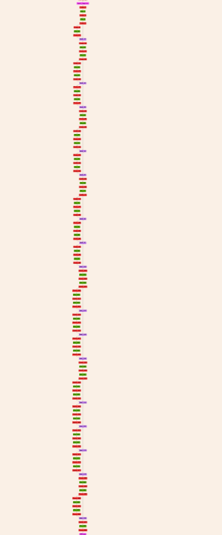
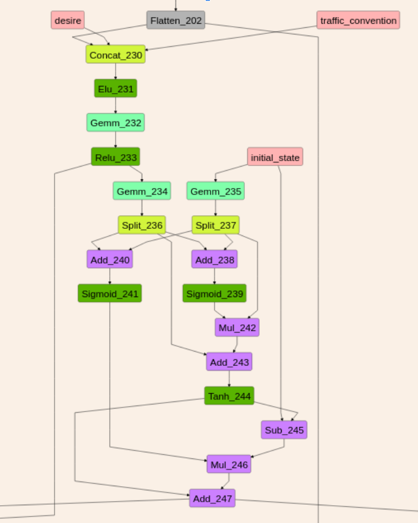
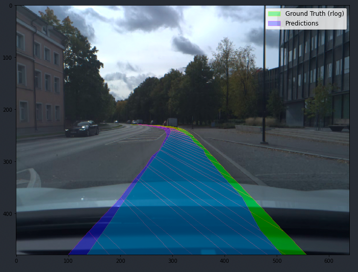
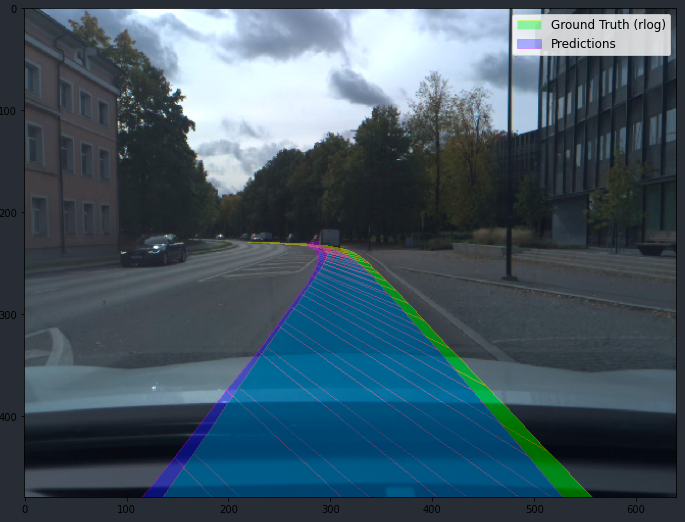

# openpilot-pipeline

[Openpilot](https://github.com/commaai/openpilot) is the currently leading[^1] Advanced Driver-Assitance System (ADAS), developed & open-sourced by [Comma AI](https://comma.ai/).

This repo attempts to re-create the complete data & training pipeline to allow training custom driving models for Openpilot.


## About

The project is *in early development*. The ultimate goal is to create a codebase for training end-to-end autonomous driving models.

Right now, the only implemented feature is distillation of path planning *from the original Openpilot driving model*. To train from scratch, we need to implement the creation of accurate ground truth paths by processing data from cars' GNSS, IMU, and visual odometry with [laika](https://github.com/commaai/laika) and [rednose](https://github.com/commaai/rednose) (PRs welcome!).

Below we describe the implemented parts of the pipeline and current training results.

## Model

We use the original CommaAI's supercombo model from [Openpilot 0.8.10 release]([Openpilot 0.8.10 Release](https://github.com/commaai/openpilot/tree/v0.8.10/models). It consists of three parts:

- convolutional feature extractor (based on Resnet), followed by
- a GRU (used to capture the temporal context)
- several fully-connected branches for outputting paths, lane lines, road edges, etc. (explained in detail below) 

<table>
  <tr>
    <td>CNN Feature Extractor</td>
     <td>GRU</td>
     <td>Output Heads</td>
  </tr>
  <tr>
    <td></td>
    <td></td>
    <td></td>
  </tr>
 </table>

Since Openpilot's repo Git LFS was broken at the time of our development, we kept a [copy](common/models/supercombo.onnx) of the model in our repo for easy access.

Model inputs and outputs are described in detail in the [official repo](https://github.com/commaai/openpilot/tree/master/models). 

### Inputs

The primary input to the model is two consecutive camera frames, converted into YUV420 format (good description [here](https://github.com/peter-popov/unhack-openpilot#image-preprocessing)), reprojected and stacked into a tensor of shape `(N,12,128,256)`.

Three other model inputs fed after the convolutional extractor into the GRU are: 

- desire `(N,8)`
- traffic convention `(N,2)`
- recurrent state `(N,512)`

### Outputs
The outputs from the task-specific branches are concatenated, resulting in the model output of shape `(N,6472)`. We took the code for parsing the outputs from an [older version](https://github.com/commaai/openpilot/blob/v0.8.9/selfdrive/modeld/models/driving.cc#L15-L49) of Openpilot.

Most outputs are predicted in the form of mean and standard deviation over time. Path plans, lane lines, road edges, etc are predicted for 33 timestamps [quadratically spaced out](https://github.com/commaai/openpilot/blob/7d3ad941bc4ba4c923af7a1d7b48544bfc0d3e13/selfdrive/common/modeldata.h#L14-L25) for 10 seconds or 192 meters from the current position. These predictions are in the so-called calibrated frame of reference, explained in detail [here](https://github.com/commaai/openpilot/tree/master/common/transformations).

Further details on model outputs is in the [model readme](https://github.com/commaai/openpilot/tree/7d3ad941bc4ba4c923af7a1d7b48544bfc0d3e13/models).

### Converting the model from ONNX to PyTorch

To fine-tune an existing driving model, we convert it from the ONNX format to PyTorch using [onnx2pytorch](https://github.com/ToriML/onnx2pytorch). Note: there is a bug in onnx2pytorch that impacts the outputs; until this [PR](https://github.com/ToriML/onnx2pytorch/pull/38) is merged, we must manually set activation functions to be [*not* in-place](https://github.com/nikebless/openpilot-pipeline/blob/main/train/model.py#L28-L29).

### Loss functions

As mentioned above, we are currently doing only distillation of path prediction. We implement two loss functions:

- [KL-divergence](https://github.com/nikebless/openpilot-pipeline/blob/main/train/train.py#L69-L77)
- [Winner-takes-all Laplacian NLL](https://github.com/nikebless/openpilot-pipeline/blob/main/train/train.py#L61-L66)

The latter one works much better, and the code for it was shared with us by folks at CommaAI (thanks a lot!).

## Data pipeline

A script in `gt_hacky` runs the official Openpilot model on the full dataset and saves the outputs.

True ground truth creation is currently not implemented.

For the dataset, we use [comma2k19](https://github.com/commaai/comma2k19), a 33-hour (1980 min) driving dataset made by CommaAI: 

> The data was collected using comma EONs that has sensors similar to those of any modern smartphone including a road-facing camera, phone GPS, thermometers and 9-axis IMU. Additionally, the EON captures raw GNSS measurements and all CAN data sent by the car."

To use your data for training, you currently need to collect it with a [Comma 2 device](https://comma.ai/shop/products/two) (no support for version 3 yet). In the future, when true ground truth creation is implemented, you *might* be able to use a different device. Still, you'll need to adjust some hardware-related code (camera intrinsics, GNSS configuration in laika post-processing, etc). If you need more data than you can store on the device or Comma cloud or want to do it at scale, you can use [retropilot-server](https://github.com/florianbrede-ayet/retropilot-server), a custom cloud server that re-implements Comma's API.


## Training pipeline

### Training loop

* **General:** 
  * Recurrent state of the GRU and desire are intialized with zeros. 
  * Traffic convention is hard-coded for left-hand-side driving.
  * A batch consists of `batch_size` sequences of length `seq_len` each from a different one-minute driving segment to reduce data correlation.
  

* **GRU training Logic:**
  * The first batch of each segment is not used to update the weights (recurrent state warmup).
  * The hidden state is preserved between batches of sequences within the same segment.
  * The hidden state is reset to zero when the current `batch_size` segments end.
 

* **Wandb**
  * All the hyperparameters, loss metrics, and time taken by different training components are logged and visualized in Wandb.
  * For each validation loop, predictions vs ground truth are visualized on Wandb for the same one training and one validation segment.


### Data loading

Our preliminary experiments showed that having more driving segments per batch is crucial for convergence. Batch size 8 (each batch has sequences from 8 different segments) leads to overfitting, while batch size 28 (maximum we could fit on our machine) results in a good performance.

PyTorch multi-worker data loader does not support parallel *sample* loading, which is necessary for creating batches of sequences from different segments. We implemented a custom data loader where each worker loads a single segment at a time, and a separate background process combines the results into a single batch. We also implement pre-fetching and a (super hacky) synchronization mechanism to ensure the collation process doesn't block the shared memory until the main process has received the batch. 

Altogether this results in relatively low latency: ~150ms waiting + ~175ms transfer to GPU on our machine. Instead of the hacky sync mechanism, inter-process messaging might bring the waiting down to <10ms. Speeding up transfer to GPU might be done through memory pinning, but it didn't work when we tried pinning tensors before pushing them to the shared memory queue. It probably has to be done on the consumer process side, but we are not sure how to keep it from slowing down the rest of the pipeline.

**NOTE:** The data loader requires *two CPU cores (one train, one validation) per unit of batch size*, plus additional two CPU cores for the main and background (collation) processes. The per-unit-of-batch-size cost could be brought down to 1 CPU-core if we implement stopping/restarting the train/validation workers as needed.

## How to Use

### System Requirements

- Ubuntu 20.04 LTS **with sudo** for compiling openpilot & ground truth creation. You can probably run training on any Linux machine where PyTorch is supported.
- 50+ CPU cores, but more (~128-256) would mean better GPU utilization.
- GPU with at least 6 GB of memory.

### Installations
1. [Install openpilot](https://github.com/commaai/openpilot/tree/master/tools)
2. Clone the repo
```bash
git clone https://github.com/nikebless/openpilot-pipeline.git
```

3. Install conda from [here](https://docs.conda.io/projects/conda/en/latest/user-guide/install/linux.html)
4. Install the repo's conda environment: <!-- TODO: update environment with imageio and moviepy -->

```bash
cd openpilot-pipeline/
conda env create -f environment.yml
```

### Run

1. Get the dataset in the [comma2k19](https://github.com/commaai/comma2k19) format available in a local folder. You can use comma2k19 or your own collected data, as explained in the [data pipeline](#data-pipeline).
2. Run ground truth creation using [gt_hacky](gt_hacky) <!-- TODO: merge calibration extraction with gt_hacky -->
3. Set up [wandb](https://docs.wandb.ai/quickstart)
4. Run Training
* via slurm script
  ```bash
  sbatch train.sh --date_it <run_name> --recordings_basedir <dataset_dir>
  ```

* directly
  ```bash
  python train.py --date_it <run_name> --recordings_basedir <dataset_dir>
  ```
The only required parameters are `--date_it` and `--recordings_basedir`. Other parameters description of the parameters:

* `--batch_size` - maximum batch size should be no more than half of the number of available CPU cores, minus two. Currently, we have tested the data loader until batch size `28` (maximum for 60 cores).
* `--date_it` - the name of the training run for Wandb.
* `--epochs` - number of epochs for training, default is `15`.
* `--grad_clip` - gradient clipping norm, default is `inf` (no clipping).
* `--l2_lambda` - weight decay value used in the adam optimizer, default is `1e-4`.
* `--log_frequency` - after every how many training batches you want to log the training loss to Wandb, default is `100`.
* `--lr` - learning rate, deafult is `1e-3`
* `--lrs_factor` - factor by which the scheduler reduces the learning rate, default is `0.75 `
* `--lrs_min` - minimum learning rate, default is `1e-6`
* `--lrs_patience` - number of epochs with no improvement when the learning rate is reduced by the scheduler, default is `3`
* `--lrs_thresh` - sensitivity of the learning rate scheduler, default is `1e-4`
* `--mhp_loss` - use the multi hypothesis laplacian loss. By default, `KL-divergence`-based loss is used.
* `--no_recurr_warmup` - disable recurrent warmup. Enabled by default. 
* `--no_wandb` - disable Wandb logging. Enabled by default.
* `--recordings_basedir` - path to the recordings root directory.
* `--seed` - for the model reproducibility. The default is `42`.
* `--seq_len` - length of sequences within each batch. Default is `100`.
* `--split` - training dataset proportion. The rest goes to validation; no test set is used. Default is `0.94`.
* `--val_frequency` - validation loop runs after this many batches. Default is `400`.

### Using the model

0. Convert the model to ONNX format
```bash
cd train
python torch_to_onnx.py <model_path>
```
1. In a simulation (Carla)

> **Note:** As Openpilot is always under development, the current version of the Carla bridge is sometimes broken. This is not helped by the fact that the bash script always pulls the latest Openpilot docker container. If you run into issues setting up the simulator, you can try updating the `start_openpilot_docker.sh` script with a tag from an older docker container version from the [history](https://github.com/commaai/openpilot/pkgs/container/openpilot-sim/versions?filters%5Bversion_type%5D=untagged).

<!-- TODO: add exact versions that worked for us -->


* Make sure that you have installed [openpilot](https://github.com/commaai/openpilot/tree/master/tools). 
* Make sure that CUDA drivers are installed properly (e.g. `nvidia-smi` is available) 
* Go to the sim folder in cloned openpilot repo. 
  ```bash
  cd openpilot/tools/sim 
  ```
* Add your model in `openpilot/models` and rename it to `supercombo.onnx`.
* Mount the models directory into the container at the end of the `docker run` command in the script [start_openpilot_docker.sh](https://github.com/commaai/openpilot/blob/master/tools/sim/start_openpilot_docker.sh) by adding:
```
--mount type=bind,source=”$(HOME)/openpilot/models”,target=”/openpilot/models”
```

* Open two separate terminals and execute these bash scripts. 
  ```bash
  cd openpilot/tools/sim 

  ./start_carla.sh
  
  ./start_openpilot_docker.sh
  ```
2. In your car (via the Comma 2 device)

  * [Convert to DLC](doc/ONNX_to_DLC.md)
  * Replace the original model on the device via SSH

## Our Results

So far, the Likelihood loss worked much better, resulting in faster convergence than KL divergence (unintuitively):

<table>
  <tr>
    <td>Likelihood model (~1h of training) </td>
     <td>KL divergence model (~20h of training)</td>
  </tr>
  <tr>
    <td></td>
    <td></td>
 </table>

## Technical improvement ToDos

**Important**
- [ ] Use drive calibration info in inputs transformation & for visualization
- [ ] Do not crash training when a single video failed to read

**Nice to haves**
- [ ] Better synchronization mechanism to speed up data loader


[^1]: Top 1 Overall Ratings, [2020 Consumer Reports](https://data.consumerreports.org/wp-content/uploads/2020/11/consumer-reports-active-driving-assistance-systems-november-16-2020.pdf)

